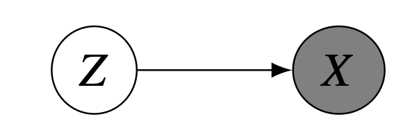
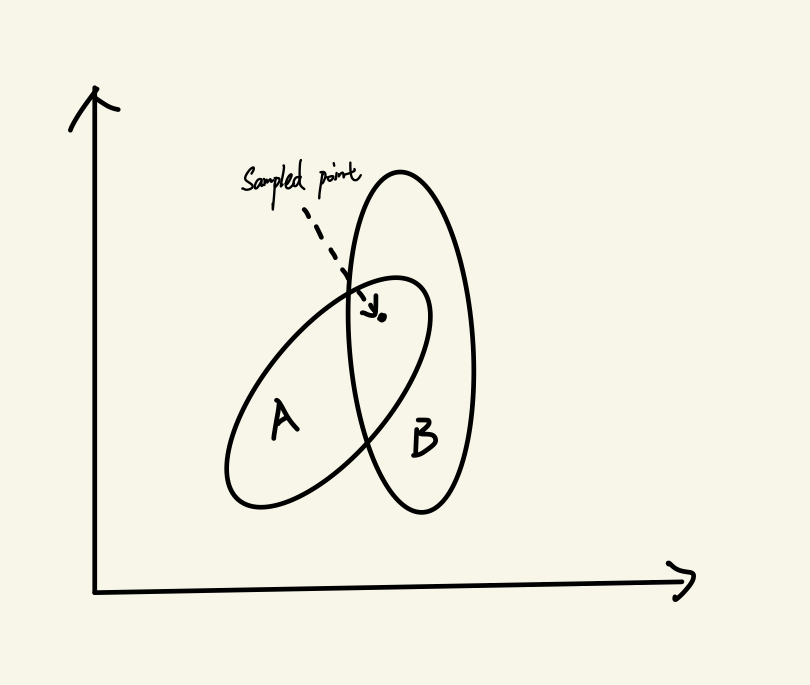

# Introduction
Soft Actor-Critic (SAC) is a model-free off-policy deep reinforcement learning algorithm that can be used to solve control tasks in many fields such as robotic [@haarnoja2019learning], game playing [@christodoulou2019soft] and autonomous driving [@tang2022highway].It is considered as a sample-efficient RL algorithm since it uses a replay buffer to store observations and reuse the observations to train the network. However, when it comes to an "end-to-end" task, namely, learning a policy directily from raw sensory observations, such as images, it's still a challenging work for SAC algorithm. One reason for the inefficiency of SAC in such a task is that the agent trying to learn a representation of high dimensinal observations and the policy simultaneously. When the two objects are entangled, the network of agents requires more observation data to adjust its parameters for a good policy. A natural idea to improve efficiency is to separate representation learning from policy learning. That is to say, the agent will learn a good representation of the high-dimensional observations, which should be low-dimensional and ideally, capture all significant underlying information of the observation. Then, the agent will learn a policy on the low-dimensional representation. The second step could just be SAC algorithm itself as it shows sample-efficiency when it has a task-relevant state input. The problem is in the first step, namely, how can we learn a good representation of the observations? A simple solution is to train an auto-encoder that maps the image to a low-dimensional latent space by using reconstruction error as the auxiliary loss function. Variational autoencoder (VAE) is a popular and powerful autoencoder architecture that could map the input to a latent space that is regularized to avoid overfitting. Avoiding overfitting for the representation learning is essential for SAC agents since it is encouraged to explore different policies, which means the agents are more likely to encounter unobserved states of the environment compared to other RL agents. Therefore, the representation learning should generalize to unseen observations. In theory, VAE would give us this good property of representation. In this post, we will first give a simple introduction to SAC and VAE, and then examine the performance of the approach that combines SAC and VAE on three control tasks about game-playing and robotics. 

# Background
In this section, we will give an intuition behind SAC and VAE, as well as some key mathematical formulas in the algorithms. We start from the SAC algorithm.

## Soft Actor-Critic (SAC)
A fundamental problem in RL problem is the trade-off between exploitation and exploration. Many RL algorithms try to balance this trade-off in different approaches such as &epsilon;-greedy search (used in DQN),entropy-regularization (used in PPO) and adding exploration noise (used in DDPG). SAC follows another approach called maximum entropy, which introduces an entropy term in the objective function to maximize the entropy of the policy. Different from the entropy-regularization used in PPO, instead of maximizing the entropy of the policy in the current step, the maximum entropy framework seek the maximum sum of entropy in the long term. The advantage of doing this is encouraging the agent to explore the environment as much as possible. Imagine our task is to train a robot arm to move an object to a target place on a stage. There are multiple ways to complete this task. The robot arm can simply push the object all the way to the target place. It can also grab the object (assume grabbing is an available operation) in the air and put it down to the target place. Indeed, if we look at the steps that are required to finish the task, pushing the object directly to the target place may be the optimal policy. However, if we put an obstacle in the middle of the object and the target place, this policy can't even complete the task. Therefore, what we really want is to learn a policy that could subsume not only the optimal policy but also other sub-optimal policies to deal with potential environmental change. In other words, we want the learned policy to be versatile enough to have a robust performance under the change of the environment. Another benefit of more exploration is avoiding being trapped in a local optimal policy. It motivates the agent to try actions that are not greedy or optimal at the current step, but these actions may be vital to achieve a higher expected reward in the future. 

### Maximum Entropy RL
Now, the problem is how can we implement this idea of maximizing the entropy of policy in the long term. First, we need to define how to represent a policy. One straightforward way is to choose the action greedily according to action-value function. But that would make the policy deterministic and it's hard to maximize the entropy of a deterministic policy (we have &epsilon;-greedy or adding exploration noise for deterministic policy). Another way is to encode the policy as a distribution, which would make the policy stochastic and the entropy of a distribution is well defined. Furthermore, depending on the type of the selected distribution, the policy can be used in both discrete control tasks and continual control tasks (The original SAC paper only introduces the algorithm under the continual control tasks, but another paper extended it to discrete control tasks [@christodoulou2019soft]).

We can define the policy as a conditional distribution $\pi(\cdot|s)$ that gives the probability of available actions under a certain state $s$, and we use $\mathcal{H}(\cdot)$ to denote the entropy function. With the two notions, we can write down our objective:
$$
J(\pi) = \mathbb{E}_{\tau \sim \pi}[\ \sum_{t=0}^{T} \gamma^t(\mathcal{H}(\pi(\cdot|s_t))) ]\
$$,
where $\tau$ denotes the trajectory sampled by policy $\pi$ and $\gamma$ is the discount factor that controls how much we should value the future steps. Then, we can add the standard RL objective, the total expected reward, into the formula, 
$$
J(\pi) = \mathbb{E}_{\tau \sim \pi}[\ \sum_{t=0}^{T} \gamma^t(r(s_t,a_t)+\alpha\mathcal{H}(\pi(\cdot|s_t))) ]\
$$, 
where $r(\cdot,\cdot)$ is the reward function and $a_t$ is the action sampled from the policy $\pi$. Also, we add a temperature coefficient $\alpha$ on the entropy term, since we want to control how much exploration we want. With this formula, we close the look to the maximum entropy framework.

### Actor-Critic
Now that we understand what we want to optimize, we can take a look at how to optimize this object. As the name suggested, SAC uses an Actor-Critic approach to optimize its objective. In this approach, "Critic" is responsible for estimating the value function or the action-value function (Q function), while "Actor" is responsible for updating the policy in the direction that can maximize the objective function. But, how can we associate the "Critic" with the "Actor"? They seem like doing something unrelevant to each other at first glance. Here, we need some help from the basis of RL: the Bellman Equation.

## Variational Autoencoder (VAE)
To understand what is a VAE, we need to first introduce the autoencoder architecture. An autoencoder consists of two parts: an encoder and a decoder. Both of them are a neural network.  Giving a data point, the encoder maps it to a latent space, and the decoder maps the data point from the latent space to its original space. The objective of an autoencoder is to reconstruct the original data point as much as possible. We can write this objective (reconstruction error) more formally,
$$
\mathcal{L} = \sqrt{(X - \bar{X})^2 }
$$,
where $\bar{X}$ is the reconstructed data point. 

What we want from the autoencoder is its ability to map a high-dimensional observation to a low-dimensional latent representation of the observation, which should keep an underlying structure of the data point. Although the traditional autoencoder is good at encoding the data point to a low-dimensional space, it lacks the ability to learn a good representation of the data point. In an extreme case, an autoencoder with a large capacity can simply remember all data points in the training set and encode them into a one-dimensional representation that captures nothing from the original data point. In this case, the autoencoder can simply overfit the training data set and get zero reconstruction error. If we look at the formula of the reconstruction error, there is no such part to prevent the autoencoder from overfitting and force it to learn a good representation. Essentially, what causes this problem is that the latent space of the autoencoder is not constrained. The encoder can map original data points to any points in the latent space. Two similar original data points may map to two faraway points in the latent space and two different original data points can be mapped to two close points in the latent space. This makes the latent space unorganized and hard to find a good representation of the original data points. Therefore, we need to find a way to constrain the latent space. 

An idea to constrain the latent space is using distribution. Firstly, the distribution itself is a constraint to the latent space, since the data points in the latent space are forced to be more organized and structural to match the shape of the distribution. Second,  we can use the KL divergence, which is a measure of the distance between two distributions, to further control the structure of distributions.  Following this idea, VAE introduced the latent variable model, which assumes the observable variable $X$ is generated by an unobserved latent variable $Z$. With this model, we can define the original data points distribution as a marginal distribution $p(X)$. Our objective then would be to find a posterior distribution $p(Z|X)$ that projects the data points from the space of $X$ to the space of $Z$, and $p(X|Z)$ that restores $Z$ to the space of $X$. The encoder and decoder in the autoencoder architecture are exactly an approximator to $p(Z|X)$ and $p(X|Z)$.

<figure>

    
    <figcaption>Figure 1. The latent variable model</figcaption>
</figure>
After introducing the latent variable model, VAE changed the autoencoder from two major points:

1. Instead of encoding the original data point to a data point in a latent space, VAE encodes it to a distribution in the latent space. 
2. VAE constrains the distribution in the latent space to be close to a prior distribution (normally a standard multivariate Gaussian distribution).

The first point makes the similar points projected to be close in the latent space (A property called continuity). This is a tricky point to understand. What is the difference between encoding the original data points to a point in the latent space and encoding them to distributions over the latent space? If we use a Gaussian distribution to represent the posterior distribution in the latent space, isn't just adding another vector (we have mean vector and variance vector for a Gaussian random variable) to the latent variable compared to encoding the original data point to a data point? This is true, but after we encode a data point to a distribution, we will samle a point from the distribution, and the decoder will reconstruct it to the original data point. This makes everything different. If two different data points are encoded to two distributions A and B, and they are close to each other, the point sampled from distribution A is more likely to be decoded to the original data point that is encoded to distribution B, since the point is possibly sampled from both A and B and the decoder can't really distinguish which distribution the point is sampled from. This situation will cause a large reconstruction error in the training. The optimization process is basically preventing this situation, and the best way is to make sure the distributions encoded from different data points are far away from each other in the latent space and similar points close to each other.

<figure>

    
    <figcaption>Figure 2. Point sampled from close distributions </figcaption>
</figure>

The second point makes sure the encoded distributions are close to the prior distribution. Why would we want that? That is because VAE is a generative model, so it should be able to generate meaningful new data points in the input space from most areas of latent space (a property called completeness). If the distributions are not forced to close to a prior distribution, the autoencoder is more likely to learn distributions that scatter over the latent space to minimize the reconstruction error, which leads to many areas in the latent space being blank and point sampled from these areas would be decoded to something meaningless as the decoder never learn how to decode points from these areas. This is an objective that contradicts to the reconstruction error since it tries to make the encoded distributions overlap with each other while the reconstruction error tries to pull apart them. As a consequence, the images reconstructed by the VAE are normally more blurry.  

Combining the two changed points together, We can rewrite the objective of autoencoder to
$$
\mathcal{L} = \sqrt{(X - \bar{X})^2 } + KL(p(Z|X)||p(Z))
$$,
where $p(z)$ is a standard multivariate Gaussian and $p(Z|X)$ is also a Gaussian. With this objective, the distributions that are encoded from the original data points are forced to be close to a standard Gaussian in the latent space. The optimization process balances the reconstruction error and the KL divergence. This objective can also be derived from a more formal way, and it can be written as the Evidence Lower Bound (ELBO) 
$$
ELBO = \mathbb{E}_{z \sim p(Z|X)} [\ \text{log}p(X|Z) + KL(p(Z|X)||p(Z)) ]\
$$.
With the ELBO, we close the introduction to the VAE.